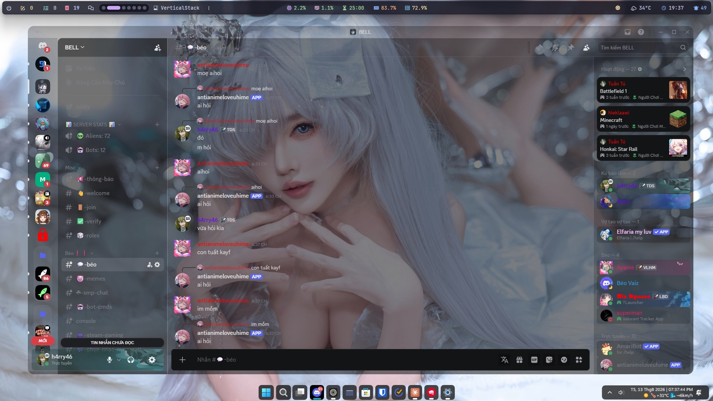
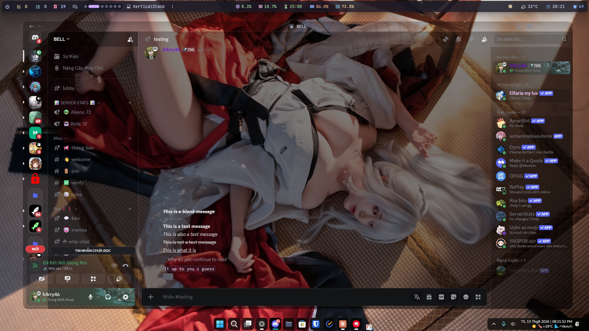

[release-badge]: https://img.shields.io/badge/Release-v1.0.1-blue
[release-link]: https://github.com/h4ry46/Absolute-Transparency/releases
[license-badge]: https://img.shields.io/badge/License-Apache--2.0-green
[license-link]: https://github.com/h4ry46/Absolute-Transparency/blob/main/LICENSE

# Absolute Transparency

A fully transparent and frosted-glass theme for Discord.

[![Release][release-badge]][release-link]
[![License][license-badge]][license-link]

## Screenshots

## ✨ Features

* Fully transparent Discord interface
* Frosted glass / blur effect
* Customizable transparency and blur
* Works with [BetterDiscord](https://betterdiscord.app/)
* Works with [Vencord](https://vencord.dev/)

## ⚠️ Requirements

Before installing the theme, you need:

* **Windows 11 22H2 or newer**
* [DWMBlurGlass](https://github.com/Maplespe/DWMBlurGlass)
* [BetterDiscord](https://betterdiscord.app/) or [Vencord](https://vencord.dev/)

You also need to configure DWMBlurGlass using [`DWM-config.png`](DWM-config.png).

## 🔧 Setup

### 1. Configure DWMBlurGlass

Install [DWMBlurGlass](https://github.com/Maplespe/DWMBlurGlass).

After installing it, open and configure it to match the settings shown in [`DWM-config.png`](DWM-config.png) or as you liked.

### 2. Enable Transparency in Discord

**This step is required for the theme to work correctly.**

#### BetterDiscord

Go to:

**Settings → Window Preferences → Enable Transparency**

Enable **Enable Transparency**, then restart Discord.

#### Vencord

Open Vencord settings and find the **Enable Transparency** option to enable it.

Then restart Discord.

## 📥 Installing

### BetterDiscord

1. Download the theme from the [Releases][release-link] page.
2. Press `Win + R`.
3. Paste:
   `%appdata%\betterdiscord\themes`
4. Press **Enter**.
5. Move the downloaded `Absolute Transparency.theme.css` file into this folder.
6. Open Discord and enable **Absolute Transparency** in **BetterDiscord → Themes**.

### Vencord

1. Download the theme from the [Releases][release-link] page.
2. Press `Win + R`.
3. Paste:
   `%appdata%\vencord\themes`
4. Press **Enter**.
5. Move the downloaded `Absolute Transparency.theme.css` file into this folder.
6. Open Discord and enable **Absolute Transparency** in **Vencord → Themes**.

## 🌐 Online Version

If your Discord client supports installing themes using a URL, you can use the online version:

`https://raw.githubusercontent.com/h4ry46/Absolute-Transparency/refs/heads/main/Absolute%20Transparency.theme.css`

## ❓ Troubleshooting

### Discord is not transparent

Make sure that:

* Discord Transparency is enabled.
* You restarted Discord after enabling Transparency.
* DWMBlurGlass is installed and configured correctly using [`DWM-config.png`](DWM-config.png).
* You are running Windows 11 22H2 or newer.

## 📄 License

This project is licensed under the [Apache-2.0 License][license-link].
